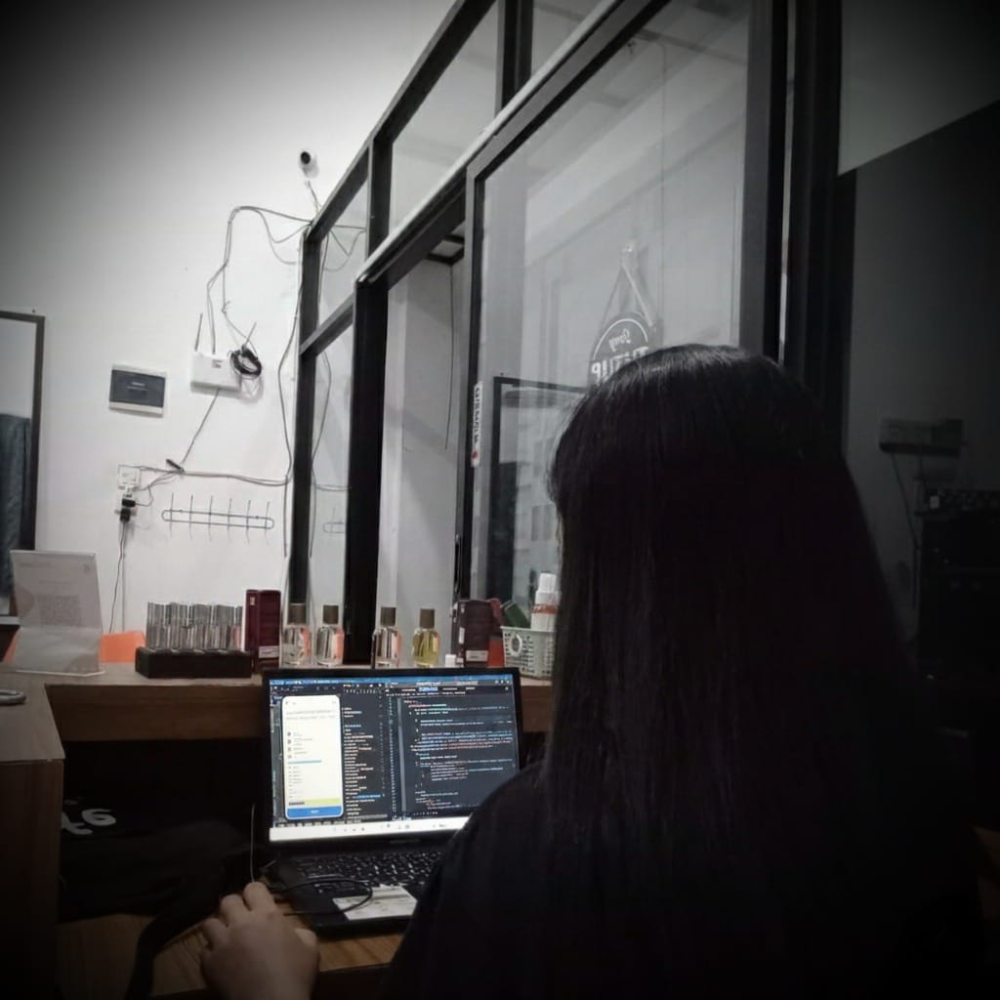
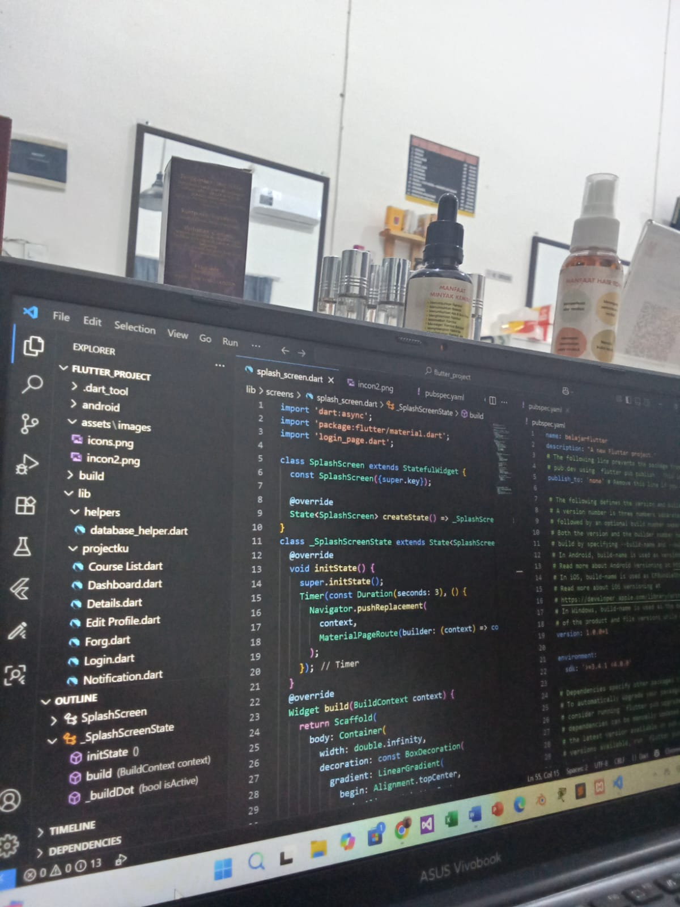

<h2 align="center" style="color: red;">Building Digital Experiences 👩‍💻</h2>

  Web Developer & UI/UX Enthusiast from Indonesia 🇮🇩  
  Passionate about creating clean, modern, and user-friendly applications.

 

<h3>🛠 Tech Stack</h3>

  
  
  
  
  
  
  
  
  
  
  
  

 

<h3>👩‍💻 About Me</h3>

- 🎓 Informatics Engineering Student
- 💻 Focused on Web Development & UI/UX Design
- 🚀 Currently learning Flutter & Backend Development
- 🌱 Always improving coding skills and design thinking

 

<!-- Github Stats Light-->

  

<!-- Github Stats Dark-->

  

<!-- Most Used Languages -->

  <picture>
    <source
      media="(prefers-color-scheme: dark)"
      srcset="https://github-readme-stats.vercel.app/api/top-langs/?username=Firaa93&langs_count=20&theme=ambient_gradient"
    />
    
  </picture>

